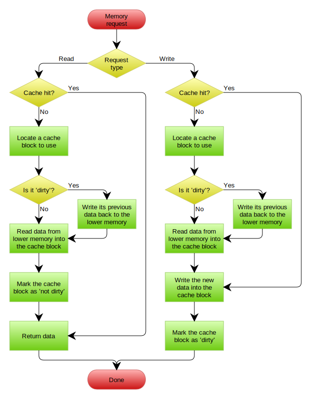
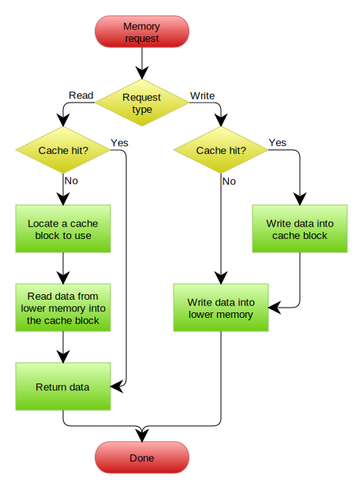

# Про swap и не только

Источники:

* https://chrisdown.name/2018/01/02/in-defence-of-swap.html
* https://unix.stackexchange.com/questions/677006/what-is-anon-pages-in-memory
* https://www.kernel.org/doc/gorman/html/understand/understand013.html
* https://www.kernel.org/doc/gorman/html/understand/understand014.html
* https://habr.com/ru/companies/selectel/articles/303190/
* https://docs.kernel.org/admin-guide/mm/zswap.html#zswap
* https://www.youtube.com/watch?v=mbqnjUR3LwY
* https://www.youtube.com/watch?v=7aONIVSXiJ8
* https://www.youtube.com/watch?v=tpRlczF0pqw
* https://lpc.events/event/11/contributions/896/attachments/793/1493/slides-r2.pdf
* https://docs.kernel.org/admin-guide/cgroup-v2.html
* https://biriukov.dev/docs/page-cache/4-page-cache-eviction-and-page-reclaim/
* https://manybutfinite.com/post/anatomy-of-a-program-in-memory/
* https://habr.com/ru/companies/smart_soft/articles/185226/
* https://habr.com/ru/companies/smart_soft/articles/226315/
* https://habr.com/ru/companies/smart_soft/articles/228937/


*Обычное описание swap'a выглядит следующим образом:*

> По сути, **swap** — это аварийная память; пространство, отведенное на случай, если вашей системе временно потребуется больше физической памяти, чем имеется в оперативной памяти. Это считается «плохим» в том смысле, что это медленно и неэффективно, и если вашей системе постоянно приходится использовать **swap**, то ей явно не хватает памяти. […] Если у вас достаточно оперативной памяти для удовлетворения всех ваших потребностей, и вы не ожидаете, что она когда-либо будет исчерпана, то вы можете абсолютно спокойно отказаться от использования **swap**

или

>Многие знают о существовании swap (файл подкачки), который начинает использоваться, когда оперативной памяти начинает не хватать. Я, как и многие, стараюсь избавляться от такой штуки, потому как swap использует для хранения данных наши ssd/hdd, что в свою очередь имеет минусы:
> * медленная скорость записи/чтения
> * убивает ресурс диска
>
>Но если выключить swap, то мы рискуем повиснуть в тот момент, когда физическая память закончится, ведь магическим образом она ниоткуда не появится

Это не так. **Точнее, не совсем так?**. Но, для начала, требуется рассказать немного про память в Linux.

#### Типы памяти в Linux

В Linux существует множество различных типов памяти, и у каждого типа есть свои свойства. Понимание их нюансов является ключом к пониманию важности подкачки.

Например, есть страницы («блоки» памяти, обычно 4 КБ), отвечающие за хранение кода для каждого процесса, запущенного на вашем компьютере. Есть также страницы, отвечающие за кэширование данных и метаданных, связанных с файлами, к которым обращаются эти программы, для ускорения будущего доступа. Они являются частью кэша страниц, назовем их **файловой памятью**.

Есть также страницы, отвечающие за выделение памяти внутри этого кода, например, когда записывается новая память, выделенная с помощью malloc, или при использовании флага MAP_ANONYMOUS mmap. Это «анонимные» страницы — так называемые, потому что они ничем не подкреплены — назовем их **анонимной памятью**.

Существуют и другие типы памяти — разделяемая память, slab-память, память стека ядра, буферы и т. п. — но *анонимная память* и *файловая память* являются наиболее известными и простыми для понимания, поэтому сосредоточимся на них.

---

**Из man'ов**:

`man mmap`
```
NAME
       mmap, munmap - map or unmap files or devices into memory
...
MAP_ANONYMOUS
        The mapping is not backed by any file; its contents are
        initialized to zero.  The fd argument is ignored; however,
        some implementations require fd to be -1 if MAP_ANONYMOUS
        (or MAP_ANON) is specified, and portable applications
        should ensure this.  The offset argument should be zero.
        Support for MAP_ANONYMOUS in conjunction with MAP_SHARED
        was added in Linux 2.4.
```

`man proc_meminfo 5`
```man
AnonPages %lu (since Linux 2.6.18)
        Non-file backed pages mapped into user-space page
        tables.
```

Процесс отображает память в Linux'e с помощью системного вызова **mmap(2)**. Данная память может быть как подкреплена реальным файлом на диске, так и нет. Во втором случае получится пустой раздел памяти, называемый анонимным.
Многие знакомы с функцией **malloc(3)**, которая используется для аллокации динамической памяти. В Linux'e, в большинстве случаем, под капотом **malloc(3)** использует **mmap(2)**

---

**Не уверен в корректности перевода reclaim в данном случае. В данном контексте, это та память, которая отнимается у процесса и возвращается в пул "свободной"**

#### Освобождаемая/неосвобождаемая память (Reclaimable/unreclaimable memory)

Один из самых фундаментальных вопросов при рассмотрении конкретного типа памяти — можно ли ее освободить или нет. «Освобождение» (reclaim) здесь означает, что система может, не теряя данных, очистить страницы этого типа из физической памяти.

Для некоторых типов страниц это обычно довольно тривиально. Например, в случае чистой (clean) (немодифицированной) кэш-памяти страниц мы просто кэшируем что-то, что у нас есть на диске, для производительности, поэтому мы можем удалить страницу без необходимости выполнять какие-либо дополнительные действия.

Для некоторых типов страниц это возможно, но не тривиально. Например, в случае грязной (dirty) (модифицированной) кэш-памяти страниц мы не можем просто удалить страницу, потому что на диске еще нет наших изменений. Таким образом, нам нужно либо отклонить освобождение, либо сначала сбросить наши изменения на диск, прежде чем мы сможем удалить эту память.

Для некоторых типов страниц это невозможно. Например, в случае с анонимными страницами, они существуют только в памяти и не имеют другого резервного хранилища.

Отсюда возникает вопрос - как быть с такими страницами? Ответ прост - это то, для чего нужен **swap**

*Swap - это прежде всего механизм для равенства освобождения памяти*

**Добавить больше примеров**
Простой пример, почему может потребоваться сбросить анонимную страницу в swap:

* Во время нормальной работы программы мы можем выделить память, которая используется достаточно редко. Для общей производительности системы имеет смысл сбросить ее на диск и дождаться page fault'a, чтобы подгружать страницы по требованию, а освободившуюся память использовать для чего-то другого, что более важно.

#### Примеры при наличии/отсутствии swap'a

**При отсутствии/низкой конкуренции за память**

* **swap**: мы можем сбросить в swap редко используемую анонимную память, которая может использоваться только в течение небольшой части жизненного цикла процесса, что позволит нам использовать эту память, например, для повышения частоты попаданий в кэш.

* **no swap**: у нас нет такой возможности, так как страница заблокирована в памяти. Хотя это может не сразу проявиться как проблема, при некоторых нагрузках это может представлять собой серьезное падение производительности из-за "старых" анонимных страниц, отнимающих место, которое можно использовать для более важных вещей.

**При умеренной/высокой конкуренции за память**

* **swap**: все типы памяти имеют одинаковую вероятность быть сброшенными в swap. Это означает, что у нас больше шансов успешно освободить страницу, то есть мы можем освободить страницы, которые не будут промахом по кэшу (page fault) в ближайшее время (не возникнет эффект **пробуксовки**).

><details>
><summary>Wiki</summary>
>Пробуксовка (thrashing) - состояние, когда подсистема виртуальной памяти компьютера находится в состоянии постоянного свопинга, часто обменивая данные в памяти и данные на диске, в ущерб выполнению приложений. Это вызывает замедление или даже остановку работы компьютера. Такое состояние может продолжаться неограниченно долго, пока вызвавшие его причины не будут устранены. Когда объём предоставленной процессам памяти превышает объём имеющейся оперативной памяти, часть страниц может быть выгружена на внешний носитель. Поскольку за заданный интервал времени процесс обычно не использует всю доступную ему память, а только её часть, называемую рабочим множеством, это не сказывается на производительности. Однако если сумма рабочих множеств всех процессов превышает объём оперативной памяти, резко возрастает вероятность отказа страницы(page fault), то есть отсутствия требуемой страницы в оперативной памяти. Происходит постоянная загрузка страниц рабочих множеств активных процессов и выгрузка страниц неактивных процессов. Поскольку загрузка страницы с внешнего носителя на несколько порядков медленнее обращения к оперативной памяти, производительность компьютера резко падает. Загрузка процессора при этом невысока. Такое состояние и называется **пробуксовкой**.
</details>

* **no swap**: анонимные страницы заблокированы в памяти, так как их некуда сбрасывать. Вероятность успешного долгосрочного освобождения страниц ниже, так как у нас есть только некоторые типы памяти, которые могут быть освобождены в принципе. Риск пробуксовки выше. Может показаться, что это все равно будет лучше, так как это поможет избежать необходимости обращения к диску, но это не так — мы просто переносим дисковый ввод-вывод подкачки на удаление горячих кэшей (hot page caches) и сегментов кода, которые нам скоро понадобятся.

**При временных всплесках использования памяти**

* **swap**: Более устойчиво к временным всплескам, но, в случаяе серьезной нехватки памяти, период от начала пробуксовки до OOM killer'a может быть увеличен. Лучше видно причины возникновения данных всплесков и можно выполнять контролируемое вмешательство.

* **no swap**: OOM killer срабатывает быстрее, так как анонимные страницы заблокированы в памяти и не могут быть освобождены. Большая вероятность пробуксовки, но время между переполнением и OOM'ингом сокращается. В зависимости от приложения это может быть лучше или хуже. Например, для приложение на основе очередей лучше быстрый переход от пробуксовки к OOM killer'у. Тем не менее, так как OOM killer включается только в момент серьезной нехватки памяти, полагаться на такой алгоритм не слишком хорошая идея.

#### Как готовить swap

Достаточно сложно описать некий общий эвристический алгоритм, который будет оптимальным в любой ситуации, поэтому важно иметь интерфейс, с помощью которого можно "подсказывать" ядру, что делать.
Исторически роль данного интерфейса выполняет переменная `vm.swappiness`.
С ней есть две основные проблемы:

* Это малая часть большой эвристической системы
* Она работает для всей системы в целом. Нельзя создать настройки для небольшого набора процессов.

Также можно использовать `mlock`, для того чтобы закрепить требуемые страницы в памяти, но для этого потребуется модификация программы или обходных путей с LD_PRELOAD.
Для языков, использующих виртуальные машины (python, например), это плохо работает, так как нет контроля над аллокацией памяти. Можно воспользоваться `mlockall`, но это также не дает точной настройки.

Для такой настройки можно воспользоваться cgroups v2, которые позволяют (в форме `memory.low`) сообщить ядру пытаться освобождать страницы у других приложений, а не у данного, по определенному порогу. Это позволяет не только предотвратить освобождение страниц нашего приложения, но и, в случае большой конкуренции за память, освободить страницы других приложения для нашего.

В обычных условиях логика swap'a ядра достаточно хорошо работает, и увеличивает общую производительность системы.
Если система дошла до стадии OOM-killer'a, то это уже поздно для нормальной настройки. Лучше предупредить возникновение такой ситуации с помощью memory pressure и друзей. Но об этом в следующий раз. 

**Сколько нужно swap'a**

В общем случае, минимально необходимый размер swap'a, требующегося для оптимального управления памятью, зависит от числа анонимных страниц, отображенных в памяти, повторное обращение к которым от приложений достаточно редко.

В современных условиях (много дискового пространства и современное ядро (4.0+)) совет достаточно прост: больше - лучше. В старых ядрах процесс `kswapd`, один из ответственных за подсистему подкачки, действовал тем агрессивнее (больше скидывал в swap), чем больше swap'a у вас было.

В большинстве случаев, нескольких гигабайт swap'a достаточно для нормального функционирования системы. Однако, можно создать несколько тестовых машин, и запустить предполагаемую, желательно неровную, с пиками, нагрузку. Если на системах не **memory starvation** (в этом случае тест не будет показательным), можно определить сколько MB swap'a в среднем задействовано. Это будет минимальным значением + некий буфер для возможного изменения нагрузки. 

Другая вещь, на которую стоит обратить внимание, это то, что чтение/запись из swap'a крайне случайна, так как сложно предсказать, какая страница будет запрошена по fault'y. Для SSD накопителей это не имеет особого значения, но на HDD это играет очень важную роль. В этом случае на помощь может придти тот факт, что обращение к страницам, принадлежащим файлам более выгодно, так как они имеют тенденцию быть менее фрагментированными.

Для желающих использовать гибернацию - размер swap'a должен быть не меньше физического размера оперативной памяти.

**Какое значение должно быть у `vm.swappiness`**

Многие считают, что данная переменная - это процент оперативной памяти, с которого система будет скидывать данные в swap (причем часть считает, что 5 - это скидывать, когда останется 5%, а часть начиная с 5% использования). Все это вкупе с идеей, что swap - это аварийная память. 

Это не так.

Данная переменная определяет, что с большей вероятностью будет освобождено - анонимные страницы или файловые.
Это сделано с помощью двух атрибутов `file_prio` (готовность освобождать файловые страницы) и `anon_prio` (готовность освобождать анонимные страницы). Значение `vm.swappiness` приравнивается как значение по умолчанию для `anon_prio` и, соответственно, вычитается из значения по умолчанию `file_prio` = 200. То есть, если `vm.swappiness = 50`, то `anon_prio = 50`, `file_prio = 150`

Если посмотреть в код ядра, то:
```c
	/*
	 * With swappiness at 100, anonymous and file have the same priority.
	 * This scanning priority is essentially the inverse of IO cost.
	 */
	anon_prio = swappiness;
	file_prio = 200 - anon_prio;
```


*Начиная с ядра 5.8 это несколько изменилось, коммит `d483a5dd`. Можно разобрать позднее*

Из комментария, да и из кода, можно понять, что значение `vm.swappiness=100` - это равномерное распределение между анонимными и файловыми страницами. 

Это означает, что `vm.swappiness` просто отношение того, насколько затратно освобождать и возвращать из swap'a анонимную память к файловой на вашем железе и типах нагрузки.

Меньшее значение говорит ядру, что редко используемые анонимные страницы дороже сбрасывать в swap. Большие значения, наоборот говорят, что либо анонимные страницы равны по стоимости, либо "дешевле".
В любом случае, подсистема управления памятью попытается сама определить, какую страницу сбрасывать, но данная переменная подталкивает в сторону определенного типа решений.

Для SSD накопителей, в общем случае равнозначно, какие страницы сбрасывать, поэтому значение `vm.swappiness=100` работает достаточно хорошо. 
На HDD лучше выставлять значения меньше, чтобы сбрасывалась больше файловая память, по уже упомянутой причине большой случайности доступа в случае сбрасывания анонимных страниц.

Обсуждая `vm.swappiness` нужно затронуть случай его равенства нулю.

В коммите `fe35004fbf9eaf67482b074a2e032abb9c89b1dd`, появившемся в ядре 3.5-rc1, произошло следующее изменение:

Теперь если `vm.swappiness=0`, то анонимные страницы не будут сбрасываться никогда, за исключением 
случая серьезной нехватки памяти. До этого такое было возможно.

Технически это выглядит так:

```diff
diff --git a/mm/vmscan.c b/mm/vmscan.c
index 67a4fd4792de87..ee975302877d16 100644
--- a/mm/vmscan.c
+++ b/mm/vmscan.c
@@ -1761,10 +1761,10 @@ static void get_scan_count(struct mem_cgroup_zone *mz, struct scan_control *sc,
 	 * proportional to the fraction of recently scanned pages on
 	 * each list that were recently referenced and in active use.
 	 */
-	ap = (anon_prio + 1) * (reclaim_stat->recent_scanned[0] + 1);
+	ap = anon_prio * (reclaim_stat->recent_scanned[0] + 1);
 	ap /= reclaim_stat->recent_rotated[0] + 1;
 
-	fp = (file_prio + 1) * (reclaim_stat->recent_scanned[1] + 1);
+	fp = file_prio * (reclaim_stat->recent_scanned[1] + 1);
 	fp /= reclaim_stat->recent_rotated[1] + 1;
 	spin_unlock_irq(&mz->zone->lru_lock);
 
@@ -1777,7 +1777,7 @@ static void get_scan_count(struct mem_cgroup_zone *mz, struct scan_control *sc,
 		unsigned long scan;
 
 		scan = zone_nr_lru_pages(mz, lru);
-		if (priority || noswap) {
+		if (priority || noswap || !vmscan_swappiness(mz, sc)) {
 			scan >>= priority;
 			if (!scan && force_scan)
 				scan = SWAP_CLUSTER_MAX;
```

Как уже говорилось выше, в большинстве случаев это не лучшее поведение системы. Поэтому желательно ограничиться в этом случае `vm.swapiness=1`

Значение по умолчанию `vm.swapiness=60`

---

#### In depths

kernel 2.6

```c
 struct swap_info_struct {
     unsigned int flags;
     kdev_t swap_device;
     spinlock_t sdev_lock;
     struct dentry * swap_file;
     struct vfsmount *swap_vfsmnt;
     unsigned short * swap_map;
     unsigned int lowest_bit;
     unsigned int highest_bit;
     unsigned int cluster_next;
     unsigned int cluster_nr;
     int prio;
     int pages;
     unsigned long max;
     int next;
 };
```

kernel 6.x.x
```c
struct swap_info_struct {
	struct percpu_ref users;	/* indicate and keep swap device valid. */
	unsigned long	flags;		/* SWP_USED etc: see above */
	signed short	prio;		/* swap priority of this type */
	struct plist_node list;		/* entry in swap_active_head */
	signed char	type;		/* strange name for an index */
	unsigned int	max;		/* extent of the swap_map */
	unsigned char *swap_map;	/* vmalloc'ed array of usage counts */
	unsigned long *zeromap;		/* kvmalloc'ed bitmap to track zero pages */
	struct swap_cluster_info *cluster_info; /* cluster info. Only for SSD */
	struct list_head free_clusters; /* free clusters list */
	struct list_head full_clusters; /* full clusters list */
	struct list_head nonfull_clusters[SWAP_NR_ORDERS];
					/* list of cluster that contains at least one free slot */
	struct list_head frag_clusters[SWAP_NR_ORDERS];
					/* list of cluster that are fragmented or contented */
	unsigned int frag_cluster_nr[SWAP_NR_ORDERS];
	unsigned int lowest_bit;	/* index of first free in swap_map */
	unsigned int highest_bit;	/* index of last free in swap_map */
	unsigned int pages;		/* total of usable pages of swap */
	unsigned int inuse_pages;	/* number of those currently in use */
	unsigned int cluster_next;	/* likely index for next allocation */
	unsigned int cluster_nr;	/* countdown to next cluster search */
	unsigned int __percpu *cluster_next_cpu; /*percpu index for next allocation */
	struct percpu_cluster __percpu *percpu_cluster; /* per cpu's swap location */
	struct rb_root swap_extent_root;/* root of the swap extent rbtree */
	struct block_device *bdev;	/* swap device or bdev of swap file */
	struct file *swap_file;		/* seldom referenced */
	struct completion comp;		/* seldom referenced */
	spinlock_t lock;		/*
					 * protect map scan related fields like
					 * swap_map, lowest_bit, highest_bit,
					 * inuse_pages, cluster_next,
					 * cluster_nr, lowest_alloc,
					 * highest_alloc, free/discard cluster
					 * list. other fields are only changed
					 * at swapon/swapoff, so are protected
					 * by swap_lock. changing flags need
					 * hold this lock and swap_lock. If
					 * both locks need hold, hold swap_lock
					 * first.
					 */
	spinlock_t cont_lock;		/*
					 * protect swap count continuation page
					 * list.
					 */
	struct work_struct discard_work; /* discard worker */
	struct list_head discard_clusters; /* discard clusters list */
	struct plist_node avail_lists[]; /*
					   * entries in swap_avail_heads, one
					   * entry per node.
					   * Must be last as the number of the
	include/linux/swap.h				   * array is nr_node_ids, which is not
					   * a fixed value so have to allocate
					   * dynamically.
					   * And it has to be an array so that
					   * plist_for_each_* can work.
					   */
};
```

Изменилось в `adfab836f4908deb049a5128082719e689eed964`

```c
struct swap_list_t {
    int head;    /* head of priority-ordered swapfile list */
    int next;    /* swapfile to be used next */
};
```

Требуется написать про: 

* сделать описание всех syscall'ов, которые упоминаются в тексте. mlock, mlockall итп
* механизм reclaim'a (lru_gen и компания)
* cgroups
* zswap
* zram
* memory pressure и config_psi
* попытаться в low-level детали


#### Что такое страничный кэш (Page Cache)

Страничный кэш - это часть виртуальной файловой системы, основной задачей которой является уменьшение задержки ввода-вывода при операциях чтения/записи

*Для самых маленьких*
"Страница" в данном случае единица памяти, с которой работает ядро Linux. Достаточно сложно (и не очень эффективно) работать с памятью на уровне байтов (или даже битов) информации. Поэтому Linux, да и большинство других операционных систем, используют так называемые **страницы** (обычно размером 4К, но бывают и другие размеры) для практически любых структур и операций. Отсюда следует, что минимальный размер элемента хранения в страничном кэше, как ни удивительно, страница. И неважно насколько малый объем данных вы хотите записать или прочитать. 

><details>
><summary>Wiki</summary>
>Виртуальная файловая система (англ. virtual file system, VFS) или виртуальный коммутатор файловой системы (англ. virtual filesystem switch) — уровень абстракции поверх конкретной реализации файловой системы. Целью VFS является обеспечение единообразного доступа клиентских приложений к различным типам файловых систем. VFS может быть использована для доступа к локальным устройствам и файлам (ext4, FAT32, NTFS), сетевым устройствам и файлам на них (NFS), а также к устройствам, не предназначенным для хранения данных (procfs). VFS декларирует программный интерфейс между ядром и конкретной файловой системой, таким образом, для добавления поддержки новой файловой системы не требуется вносить изменений в ядро операционной системы.
</details>


По это диаграмме несложно заметить, что все операуции чтения-записи идут через страничный кэш
А именно:

**Чтение**
1. User-space приложение хочет прочитать данные с диска - оно посылает запрос ядру, используя системные вызовы `read()`, `pread()`, `vread()`, `mmap()`, `sendfile()` и т.д.
2. Ядро, в свою очередь, проверяет доступность запрашиваемых страниц в страничном кэше и, если находит, возвращает их запрашивающему приложению. Можно увидеть, что к диску обращения не происходит
3. Если же таких страниц не найдено, то генерируется исключение, которое запускает какскад действий по чтению данных. А именно: ядро должно найти место под эти страницы. Соответственно, если нет места в памяти (либо в cgroup'e вызывающего процесса), то запускается механизм освобождения. После чего, читается информация с диска, пишется в страничный кэш и уже из него возвращается к запрашивающему. Начиная с этого момента, все обращения по чтению данного участка файла (причем неважно из какого процесса или cgroup'ы)будут обрабатываться из страничного кэша

**Запись**
1. User-space приложение хочет записать данные на диск - аналогично, происходит запрос к ядру, но уже с системными вызовами `write()`, `pwrite()`, `writev()`, `mmap()` и другими. Отличие от чтения в том, что запись обычно происходит быстрее, так как запись на диск в момент обращения не происходит. Ядро просто обновляет страницы в страничном кэше. Сама выгрузка происходит позднее во flush-процессе. Естественно, данное поведение не описывает случаев нехватки памяти, когда требуется сначала освободить место под запрашиваемую страницу
Страницы, которые находятся в кэше, но еще не сброшены на диск называются **грязными (dirty)**
2. Если данные процесса не являются критическими, то обычно дожидаются работы процесса планового сброса на диск. Однако, в некоторых ситуациях (например, данные по денежной транзакции), нужно гарантировать запись на диск, на случай аварии (например отключения электричества). В этом случае можно использовать системные вызовы `fsync()`, `fdatasync()` и `msync()`

><details>
><summary>Wiki</summary>
>Политика записи при кэшировании
>При чтении данных кэш-память даёт однозначный выигрыш в производительности. При записи данных выигрыш можно получить только ценой снижения надёжности. Поэтому в различных приложениях может быть выбрана та или иная политика записи кэш-памяти.
>Существуют две основные политики записи кэш-памяти — сквозная запись (write-through) и отложенная запись (write-back):
>Сквозная запись — запись производится непосредственно в основную память (и дублируется в кэш), то есть запись не кэшируется.
>Отложенная запись — запись данных производится в кэш. Запись же в основную память производится позже (при вытеснении или по истечении времени), группируя в одной операции несколько операций записи в соседние ячейки. Технология обратной записи на некоторое время делает данные в основной памяти неактуальными, для самого ЦП эти неактуальности не заметны, но перед обращением к памяти другого ведущего системной шины (контроллера DMA, bus-master-устройства шины PCI) кэш должен быть записан в память принудительно. При использовании обратной записи в многопроцессорной системе кэши различных ЦП должны быть согласованы (или процессоры должны использовать одну кэш-память).
></details>

<p float="middle">


</p>

#### Освобождение(reclaim) страниц и вытеснение(eviction) из страничного кэша

Как любой другой кэш, страничный кэш постоянно отслеживает страницы, к которым происходит 
обращение, и принимает решение, какие остаются в кэше, а какие должны быть из него удалены.

Основной механизм контроля и настройки страничного кэша - подсистема **cgroup**. Благодаря ей можно разделить память машины на несколько кэшей меньшего размера (cgroups) и таким образом контролировать и защищать определенные приложения и сервисы.


Основной единицей данного механизма является две пары списков (active, inactive) на одну cgroup'у