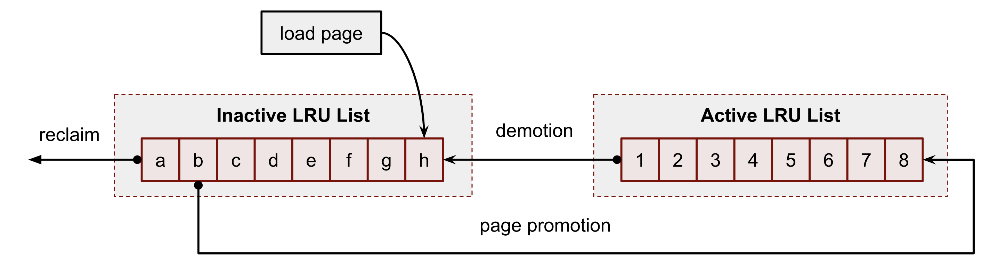
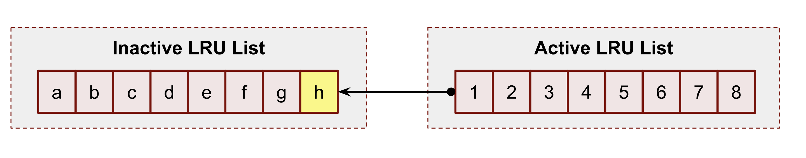
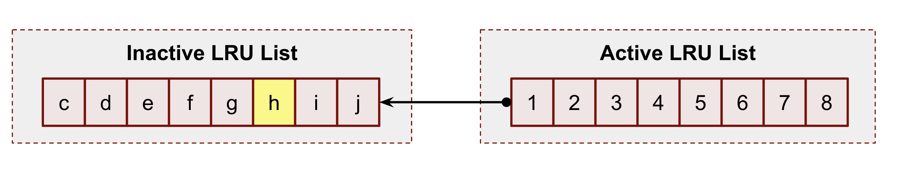
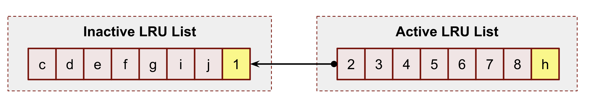
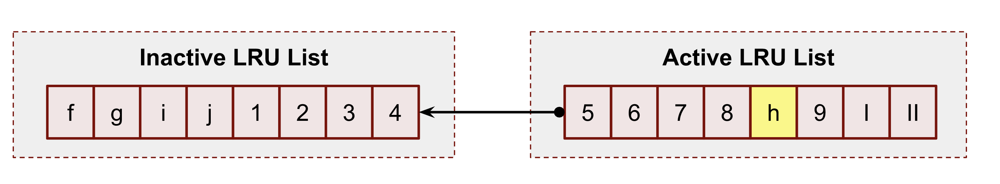
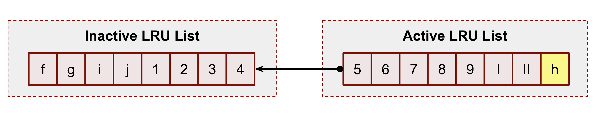
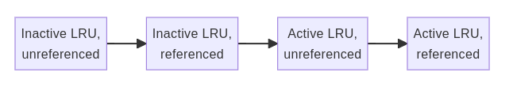
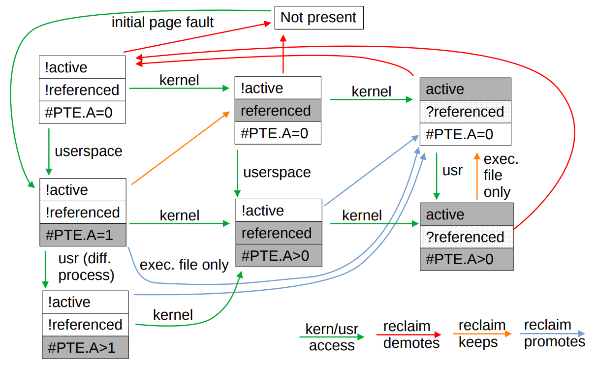

* reclaim
* swap
* thrashing
* eviction
* cgroup


# Про swap и не только

*Обычное описание swap'a выглядит следующим образом:*

> По сути, **swap** — это аварийная память; пространство, отведенное на случай, если вашей системе временно потребуется больше физической памяти, чем имеется в оперативной памяти. Это считается «плохим» в том смысле, что это медленно и неэффективно, и если вашей системе постоянно приходится использовать **swap**, то ей явно не хватает памяти. […] Если у вас достаточно оперативной памяти для удовлетворения всех ваших потребностей, и вы не ожидаете, что она когда-либо будет исчерпана, то вы можете абсолютно спокойно отказаться от использования **swap**

или

>Многие знают о существовании swap (файл подкачки), который начинает использоваться, когда оперативной памяти начинает не хватать. Я, как и многие, стараюсь избавляться от такой штуки, потому как swap использует для хранения данных наши ssd/hdd, что в свою очередь имеет минусы:
> * медленная скорость записи/чтения
> * убивает ресурс диска
>
>Но если выключить swap, то мы рискуем повиснуть в тот момент, когда физическая память закончится, ведь магическим образом она ниоткуда не появится

Это не так. Точнее, не совсем так. Но, для начала, требуется рассказать немного про память в Linux.

#### Типы памяти в Linux

В Linux существует множество различных типов памяти и у каждого типа есть свои свойства. Понимание их нюансов является ключом к пониманию важности подкачки.

Например, есть страницы («блоки» памяти, обычно 4 КБ), отвечающие за хранение кода для каждого процесса, запущенного на вашем компьютере. Есть также страницы, отвечающие за кэширование данных и метаданных, связанных с файлами, к которым обращаются эти программы, для ускорения будущего доступа. Они являются частью кэша страниц, назовем их **файловой памятью**.

Есть также страницы, отвечающие за выделение памяти внутри этого кода, например, когда записывается новая память, выделенная с помощью `malloc()`, или при использовании флага `MAP_ANONYMOUS` `mmap()`. Это «анонимные» страницы — так называемые, потому что они ничем не подкреплены — назовем их **анонимной памятью**.

**Из man'ов**:

`man mmap`
```
NAME
       mmap, munmap - map or unmap files or devices into memory
...
MAP_ANONYMOUS
        The mapping is not backed by any file; its contents are
        initialized to zero.  The fd argument is ignored; however,
        some implementations require fd to be -1 if MAP_ANONYMOUS
        (or MAP_ANON) is specified, and portable applications
        should ensure this.  The offset argument should be zero.
        Support for MAP_ANONYMOUS in conjunction with MAP_SHARED
        was added in Linux 2.4.
```

`man proc_meminfo 5`
```man
AnonPages %lu (since Linux 2.6.18)
        Non-file backed pages mapped into user-space page
        tables.
```

Процесс отображает память в Linux'e с помощью системного вызова `mmap(2)`. Данная память может быть как подкреплена реальным файлом на диске, так и нет. Во втором случае получится пустой раздел памяти, называемый анонимным.
Многие знакомы с функцией `malloc(3)`, которая используется для аллокации динамической памяти. В Linux'e, в большинстве случаем, под капотом `malloc(3)` использует `mmap(2)`


#### Освобождаемая/неосвобождаемая память (Reclaimable/unreclaimable memory)

Один из самых фундаментальных вопросов при рассмотрении конкретного типа памяти — можно ли ее освободить или нет. «Освобождение» (reclaim) здесь означает, что система может, не теряя данных, очистить страницы этого типа из физической памяти.

Для некоторых типов страниц это обычно довольно тривиально. Например, в случае чистой (clean) (немодифицированной) кэш-памяти страниц мы просто кэшируем что-то, что у нас есть на диске, для производительности, поэтому мы можем удалить страницу без необходимости выполнять какие-либо дополнительные действия.

Для некоторых типов страниц это возможно, но не тривиально. Например, в случае грязной (dirty) (модифицированной) кэш-памяти страниц мы не можем просто удалить страницу, потому что на диске еще нет наших изменений. Таким образом, нам нужно либо отклонить освобождение, либо сначала сбросить наши изменения на диск, прежде чем мы сможем удалить эту память.

Для некоторых типов страниц это невозможно. Например, в случае с анонимными страницами, они существуют только в памяти и не имеют резервного хранилища.

Отсюда возникает вопрос - как быть с такими страницами? Ответ прост - это то, для чего нужен `swap`

***`Swap` - это прежде всего механизм для равенства освобождения памяти***

Простой пример, почему может потребоваться сбросить анонимную страницу в swap:

* Во время нормальной работы программы мы можем выделить память, которая используется достаточно редко. Для общей производительности системы имеет смысл сбросить ее на диск и дождаться page fault'a, чтобы подгружать страницы по требованию, а освободившуюся память использовать для чего-то другого, что более важно.

**Примеры при наличии/отсутствии swap'a**

**При отсутствии/низкой конкуренции за память**

* **swap**: мы можем сбросить в swap редко используемую анонимную память, которая может использоваться только в течение небольшой части жизненного цикла процесса, что позволит нам использовать эту память, например, для повышения частоты попаданий в кэш.

* **no swap**: у нас нет такой возможности, так как страница заблокирована в памяти. Хотя это может не сразу проявиться как проблема, при некоторых нагрузках это может представлять собой серьезное падение производительности из-за "старых" анонимных страниц, отнимающих место, которое можно использовать для более важных вещей.

**При умеренной/высокой конкуренции за память**

* **swap**: все типы памяти имеют одинаковую вероятность быть сброшенными в swap. Это означает, что у нас больше шансов успешно освободить страницу, то есть мы можем освободить страницы, которые не будут промахом по кэшу (page fault) в ближайшее время (не возникнет эффект **пробуксовки**).

>Пробуксовка (thrashing) - состояние, когда подсистема виртуальной памяти компьютера находится в состоянии постоянного свопинга, часто обменивая данные в памяти и данные на диске, в ущерб выполнению приложений. Это вызывает замедление или даже остановку работы компьютера. Такое состояние может продолжаться неограниченно долго, пока вызвавшие его причины не будут устранены. Когда объём предоставленной процессам памяти превышает объём имеющейся оперативной памяти, часть страниц может быть выгружена на внешний носитель. Поскольку за заданный интервал времени процесс обычно не использует всю доступную ему память, а только её часть, называемую рабочим множеством, это не сказывается на производительности. Однако если сумма рабочих множеств всех процессов превышает объём оперативной памяти, резко возрастает вероятность отказа страницы(page fault), то есть отсутствия требуемой страницы в оперативной памяти. Происходит постоянная загрузка страниц рабочих множеств активных процессов и выгрузка страниц неактивных процессов. Поскольку загрузка страницы с внешнего носителя на несколько порядков медленнее обращения к оперативной памяти, производительность компьютера резко падает. Загрузка процессора при этом невысока. Такое состояние и называется **пробуксовкой**.

* **no swap**: анонимные страницы заблокированы в памяти, так как их некуда сбрасывать. Вероятность успешного долгосрочного освобождения страниц ниже, так как у нас есть только некоторые типы памяти, которые могут быть освобождены в принципе. Риск пробуксовки выше. Может показаться, что это все равно будет лучше, так как это поможет избежать необходимости обращения к диску, но это не так — мы просто переносим дисковый ввод-вывод подкачки на удаление горячих кэшей (hot page caches) и сегментов кода, которые нам скоро понадобятся.

**При временных всплесках использования памяти**

* **swap**: Более устойчиво к временным всплескам, но, в случаяе серьезной нехватки памяти, период от начала пробуксовки до OOM killer'a может быть увеличен. Лучше видно причины возникновения данных всплесков и можно выполнять контролируемое вмешательство.

* **no swap**: OOM killer срабатывает быстрее, так как анонимные страницы заблокированы в памяти и не могут быть освобождены. Большая вероятность пробуксовки, но время между переполнением и OOM'ингом сокращается. В зависимости от приложения это может быть лучше или хуже. Например, для приложение на основе очередей лучше быстрый переход от пробуксовки к OOM killer'у. Тем не менее, так как OOM killer включается только в момент серьезной нехватки памяти, полагаться на такой алгоритм не слишком хорошая идея.

**Как готовить swap**

Достаточно сложно описать некий общий эвристический алгоритм, который будет оптимальным в любой ситуации, поэтому важно иметь интерфейс, с помощью которого можно "подсказывать" ядру, что делать.
Исторически роль данного интерфейса выполняет переменная `vm.swappiness`.
С ней есть две основные проблемы:

* Это малая часть большой эвристической системы
* Она работает для всей системы в целом. Нельзя создать настройки для небольшого набора процессов.

Можно использовать `mlock`, для того чтобы закрепить требуемые страницы в памяти, но для этого потребуется модификация программы или обходных путей с `LD_PRELOAD`.
Кроме того, для языков, использующих виртуальные машины (python, например), это плохо работает, так как нет контроля над аллокацией памяти. Можно воспользоваться `mlockall`, но это также не дает точной настройки.

Для такой настройки можно воспользоваться механизмом `cgroup`, которые позволяют (в форме `memory.low`) сообщить ядру пытаться освобождать страницы у других приложений, а не у данного, по определенному порогу. Это позволяет не только предотвратить освобождение страниц нашего приложения, но и, в случае большой конкуренции за память, освободить страницы других приложения для нашего.

Важно заметить, что в обычных условиях логика swap'a ядра достаточно хорошо работает и увеличивает общую производительность системы.

И последнее: если система дошла до стадии OOM-killer'a, то это уже поздно для настройки.

**Сколько нужно swap'a**

В общем случае, минимально необходимый размер swap'a, требующегося для оптимального управления памятью, зависит от числа анонимных страниц, отображенных в памяти, повторное обращение к которым от приложений достаточно редко.

В современных условиях (много дискового пространства и современное ядро (4.0+)) совет достаточно прост: больше - лучше. В старых ядрах процесс `kswapd`, один из ответственных за подсистему подкачки, действовал тем агрессивнее (больше скидывал в swap), чем больше swap'a у вас было.

В большинстве случаев, нескольких гигабайт swap'a достаточно для нормального функционирования системы. Однако, можно создать несколько тестовых машин, и запустить предполагаемую, желательно неровную, с пиками, нагрузку. Если на системах не **memory starvation** (в этом случае тест не будет показательным), можно определить сколько MB swap'a в среднем задействовано. Это будет минимальным значением + некий буфер для возможного изменения нагрузки. 

Другая вещь, на которую стоит обратить внимание, это то, что чтение/запись из swap'a крайне случайна, так как сложно предсказать, какая страница будет запрошена по fault'y. Для SSD накопителей это не имеет особого значения, но на HDD это играет очень важную роль. В этом случае на помощь может придти тот факт, что обращение к страницам, принадлежащим файлам более выгодно, так как они имеют тенденцию быть менее фрагментированными.

Для желающих использовать гибернацию - размер swap'a должен быть не меньше физического размера оперативной памяти.

**Какое значение должно быть у `vm.swappiness`**

Многие считают, что данная переменная - это процент оперативной памяти, с которого система будет скидывать данные в swap (причем часть считает, что 5 - это скидывать, когда останется 5%, а часть начиная с 5% использования). Все это вкупе с идеей, что swap - это аварийная память. 

Это не так.

Данная переменная определяет, что с большей вероятностью будет освобождено - анонимные страницы или файловые.
Это сделано с помощью двух атрибутов `file_prio` (готовность освобождать файловые страницы) и `anon_prio` (готовность освобождать анонимные страницы). Значение `vm.swappiness` приравнивается как значение по умолчанию для `anon_prio` и, соответственно, вычитается из значения по умолчанию `file_prio` = 200. То есть, если `vm.swappiness = 50`, то `anon_prio = 50`, `file_prio = 150`

Если посмотреть в код ядра, то:
```c
	/*
	 * With swappiness at 100, anonymous and file have the same priority.
	 * This scanning priority is essentially the inverse of IO cost.
	 */
	anon_prio = swappiness;
	file_prio = 200 - anon_prio;
```
Из комментария, да и из кода, можно понять, что значение `vm.swappiness=100` - это равномерное распределение между анонимными и файловыми страницами. 


Начиная с ядра 5.8 это несколько изменилось, коммит `d483a5dd`.

```c
	/*
	 * Calculate the pressure balance between anon and file pages.
	 *
	 * The amount of pressure we put on each LRU is inversely
	 * proportional to the cost of reclaiming each list, as
	 * determined by the share of pages that are refaulting, times
	 * the relative IO cost of bringing back a swapped out
	 * anonymous page vs reloading a filesystem page (swappiness).
	 *
	 * Although we limit that influence to ensure no list gets
	 * left behind completely: at least a third of the pressure is
	 * applied, before swappiness.
	 *
	 * With swappiness at 100, anon and file have equal IO cost.
	 */
	total_cost = sc->anon_cost + sc->file_cost;
	anon_cost = total_cost + sc->anon_cost;
	file_cost = total_cost + sc->file_cost;
	total_cost = anon_cost + file_cost;
```
Вычисления чуть усложнились, но общий смысл остался прежним.

Это означает, что `vm.swappiness` просто отношение того, насколько затратно освобождать и возвращать из swap'a анонимную память к файловой на вашем железе и типах нагрузки.

Меньшее значение говорит ядру, что редко используемые анонимные страницы дороже сбрасывать в swap. Большие значения, наоборот говорят, что либо анонимные страницы равны по стоимости, либо "дешевле".
В любом случае, подсистема управления памятью попытается сама определить, какую страницу сбрасывать, но данная переменная подталкивает в сторону определенного типа решений.

Для SSD накопителей, в общем случае равнозначно, какие страницы сбрасывать, поэтому значение `vm.swappiness=100` работает достаточно хорошо. 
На HDD лучше выставлять значения меньше, чтобы сбрасывалась больше файловая память, по уже упомянутой причине большой случайности доступа в случае сбрасывания анонимных страниц.

Обсуждая `vm.swappiness` нужно затронуть случай его равенства нулю.

В коммите `fe35004fbf9eaf67482b074a2e032abb9c89b1dd`, появившемся в ядре 3.5-rc1, произошло следующее изменение:

Теперь если `vm.swappiness=0`, то анонимные страницы не будут сбрасываться никогда, за исключением 
случая серьезной нехватки памяти. До этого такое было возможно.

Технически это выглядит так:

```diff
diff --git a/mm/vmscan.c b/mm/vmscan.c
index 67a4fd4792de87..ee975302877d16 100644
--- a/mm/vmscan.c
+++ b/mm/vmscan.c
@@ -1761,10 +1761,10 @@ static void get_scan_count(struct mem_cgroup_zone *mz, struct scan_control *sc,
 	 * proportional to the fraction of recently scanned pages on
 	 * each list that were recently referenced and in active use.
 	 */
-	ap = (anon_prio + 1) * (reclaim_stat->recent_scanned[0] + 1);
+	ap = anon_prio * (reclaim_stat->recent_scanned[0] + 1);
 	ap /= reclaim_stat->recent_rotated[0] + 1;
 
-	fp = (file_prio + 1) * (reclaim_stat->recent_scanned[1] + 1);
+	fp = file_prio * (reclaim_stat->recent_scanned[1] + 1);
 	fp /= reclaim_stat->recent_rotated[1] + 1;
 	spin_unlock_irq(&mz->zone->lru_lock);
 
@@ -1777,7 +1777,7 @@ static void get_scan_count(struct mem_cgroup_zone *mz, struct scan_control *sc,
 		unsigned long scan;
 
 		scan = zone_nr_lru_pages(mz, lru);
-		if (priority || noswap) {
+		if (priority || noswap || !vmscan_swappiness(mz, sc)) {
 			scan >>= priority;
 			if (!scan && force_scan)
 				scan = SWAP_CLUSTER_MAX;
```

Как уже говорилось выше, в большинстве случаев это не лучшее поведение системы. Поэтому желательно ограничиться в этом случае `vm.swapiness=1`

Значение по умолчанию `vm.swapiness=60`

---

#### Про виртуальную память

Физическая память компьютера - ограниченный ресурс. Кроме того, она не обязательно однородна, так как доступ к ней может быть организован как набор отдельных диапазонов адресов. Также стоит учесть, как данные диапазоны адресов представлены в разных процессорных архитектурах(да и в рамках одной архитектуры могут встречаться разные реализации)

Все это может может сделать прямую адресацию памяти достаточно сложным делом. И, для того, чтобы этой сложности избежать и был разработан концепт виртуальной памяти.

**Виртуальная память** - это абстракция над деталями физической памяти, для использования приложениями, позволяющая хранить в физической памяти только необходимую информацию (и подгружать требуемую по запросу) и предоставляющая механизм защиты и контролируемого совместного использования данных различными процессами.

При использовании виртуальной памяти каждый используемый адрес является виртуальным. Когда процессор декодирует инструкции, которые читают(пишут) из(в) системной памяти, он преобразует виртуальный адрес, закодированный в данной инструкции в физический, который будет понятен контроллеру памяти.

Физическая системная память поделена на секции называемые **страницами**.
"Страница" в данном случае единица памяти, с которой работает ядро Linux. Достаточно сложно (и не очень эффективно) работать с памятью на уровне байтов (или даже битов) информации. Поэтому Linux, да и большинство других операционных систем, используют так называемые **страницы** (обычно размером 4К, но это архитектурно зависимый параметр) для практически любых структур и операций. Отсюда следует, что минимальный размер элемента хранения в страничном кэше, как ни удивительно, страница. И неважно насколько малый объем данных вы хотите записать или прочитать.

Каждая страница физической памяти может быть отображена (mapped) в одну или несколько виртуальных страниц. Такое отображение описано в таблицах страниц и позволяет преобразовывать виртуальные адреса в физические. Данные таблицы организованы иерархически.

На нижнем уровне иерархии располагаются таблицы, содержащие физические адреса настоящих страниц, используемых приложением. Вышестоящие таблицы содержат адреса нижележащих страниц. Указатель на верх этой иерархии располагается в процессорном регистре. Когда процессору требуется преобразовать адрес, он использует данный адрес для доступа к верхней таблице. Верхние биты виртуального адреса используются для индексации записи в таблице наверху иерархии. Данная запись используется для доступа к следующему уровню в иерархии, а следующие биты как индекс для поиска нужной записи. Нижние биты адресы в виртуальном адресе определяют смещение уже внутри настоящей страницы, в самом низу иерархии.


#### Что такое страничный кэш (Page Cache)

Страничный кэш - это часть виртуальной файловой системы, основной задачей которой является уменьшение задержки ввода-вывода при операциях чтения/записи


><details>
><summary>vfs</summary>
>Виртуальная файловая система (англ. virtual file system, VFS) или виртуальный коммутатор файловой системы (англ. virtual filesystem switch) — уровень абстракции поверх конкретной реализации файловой системы. Целью VFS является обеспечение единообразного доступа клиентских приложений к различным типам файловых систем. VFS может быть использована для доступа к локальным устройствам и файлам (ext4, FAT32, NTFS), сетевым устройствам и файлам на них (NFS), а также к устройствам, не предназначенным для хранения данных (procfs). VFS декларирует программный интерфейс между ядром и конкретной файловой системой, таким образом, для добавления поддержки новой файловой системы не требуется вносить изменений в ядро операционной системы.
</details>


По это диаграмме несложно заметить, что все операции чтения-записи идут через страничный кэш
А именно:

**Чтение**
1. User-space приложение хочет прочитать данные с диска - оно посылает запрос ядру, используя системные вызовы `read()`, `pread()`, `vread()`, `mmap()`, `sendfile()` и т.д.
2. Ядро, в свою очередь, проверяет доступность запрашиваемых страниц в страничном кэше и, если находит, возвращает их запрашивающему приложению. Можно увидеть, что к диску обращения не происходит
3. Если же таких страниц не найдено, то генерируется исключение, которое запускает какскад действий по чтению данных. А именно: ядро должно найти место под эти страницы. Соответственно, если нет места в памяти (либо в cgroup'e вызывающего процесса), то запускается механизм освобождения. После чего, читается информация с диска, пишется в страничный кэш и уже из него возвращается к запрашивающему. Начиная с этого момента, все обращения по чтению данного участка файла (причем неважно из какого процесса или cgroup'ы)будут обрабатываться из страничного кэша

**Запись**
1. User-space приложение хочет записать данные на диск - аналогично, происходит запрос к ядру, но уже с системными вызовами `write()`, `pwrite()`, `writev()`, `mmap()` и другими. Отличие от чтения в том, что запись обычно происходит быстрее, так как запись на диск в момент обращения не происходит. Ядро просто обновляет страницы в страничном кэше. Сама выгрузка происходит позднее во flush-процессе. Естественно, данное поведение не описывает случаев нехватки памяти, когда требуется сначала освободить место под запрашиваемую страницу
Страницы, которые находятся в кэше, но еще не сброшены на диск называются **грязными (dirty)**
2. Если данные процесса не являются критическими, то обычно дожидаются работы процесса планового сброса на диск. Однако, в некоторых ситуациях (например, данные по денежной транзакции), нужно гарантировать запись на диск, на случай аварии (например отключения электричества). В этом случае можно использовать системные вызовы `fsync()`, `fdatasync()` и `msync()`

><details>
><summary>Wiki</summary>
>Политика записи при кэшировании
>При чтении данных кэш-память даёт однозначный выигрыш в производительности. При записи данных выигрыш можно получить только ценой снижения надёжности. Поэтому в различных приложениях может быть выбрана та или иная политика записи кэш-памяти.
>Существуют две основные политики записи кэш-памяти — сквозная запись (write-through) и отложенная запись (write-back):
>Сквозная запись — запись производится непосредственно в основную память (и дублируется в кэш), то есть запись не кэшируется.
>Отложенная запись — запись данных производится в кэш. Запись же в основную память производится позже (при вытеснении или по истечении времени), группируя в одной операции несколько операций записи в соседние ячейки. Технология обратной записи на некоторое время делает данные в основной памяти неактуальными, для самого ЦП эти неактуальности не заметны, но перед обращением к памяти другого ведущего системной шины (контроллера DMA, bus-master-устройства шины PCI) кэш должен быть записан в память принудительно. При использовании обратной записи в многопроцессорной системе кэши различных ЦП должны быть согласованы (или процессоры должны использовать одну кэш-память).
></details>

<p float="middle">


</p>

#### Освобождение(reclaim) страниц и вытеснение(eviction) из страничного кэша

Как любой другой кэш, страничный кэш постоянно отслеживает страницы, к которым происходит 
обращение, и принимает решение, какие остаются в кэше, а какие должны быть из него удалены.

Основной механизм контроля и настройки страничного кэша - подсистема **cgroup**. Благодаря ей можно разделить память машины на несколько кэшей меньшего размера (cgroups) и таким образом контролировать и защищать определенные приложения и сервисы.


Основной единицей данного механизма является две пары списков (active, inactive) на одну cgroup'у:

1. Первая пара для анонимных страниц
2. Вторая для файловых

Для того, чтобы определить, какую страница требуется вытеснить, используется LRU (least recently used) алгоритм. В настоящее время была добавлена  усложненная версия **добавить про LRU GEN** 

Списки используются как очереди (FIFO) и связаны между собой таким образом, что (сильно упрощенно) в случае, если к странице идет обращение, то она тем ближе к голове списка, и, наоборот, если нет обращений - то смещается к хвосту. В случае, если страница находилась в active-списке - то она может быть разжалована за неактивность в inactive-список. А уже из хвоста этого списка и происходит вытеснение страниц.


Рассмотрим пример


Допустим, пользовательски процесс прочитал некоторые данные с диска. Это действие запустило загрузку данных в кэш. Так как это был первый каз, когда ядро обращалось к этой странице ***h***, она помещается в начало inactive-очереди cgroup'ы процесса.


Спустя некоторое время, система загружает еще 2 страницы: ***i*** и ***j***. Аналогично ***h*** они помещаются в начало inactive-очереди, что приводит к смещению всей очереди, а также к вытеснению ***a*** и ***b***


Далее, произошло обращение к странице ***h***, что привело к помещению ее в начало active-очереди. Что, в свою очередь переместило ***1*** в начало invactive-очереди.


Некоторое время к ***h*** обращения нет, поэтому она постепенно перемещается к хвосту active-очереди.


Опять произошло обращение к ***h***, что возвращает ее в начало active-очереди.

Это крайне упрощенное описание происходящего, но общее представление дает.

Подробнее:

Если в системе присутствуют NUMA-ноды, то количество LRU-списков удваивается (**непонятно, почему не умножается на количество нума нод**)

Имеется теневая(shadow) логика и флаг ссылок(referenced flag) для продвижения(promotion) и понижения(demotion) страниц.

Теневые записи (shadow entries) помогают бороться с пробуксовкой. Идея состоит в вычислении **refault distance**. Данная дистанция используется для оценки необходимости перенесения страницы из теневой записи в active-очередь. 

Флаги ссылок также учитываются в перемещении страниц между ссылками (**указать, как именно**)

Более правильный путь продвижения страницы по очередям можно представить так:



На самом деле процесс чуть более запутаный и выглядит как то так:



#### Опять про swappiness

Ядро постоянно поддерживает список свободных страниц для своих нужд и нужд userspace-приложений. В случае, если число таких страниц ниже определенного порога, то ядро начинает сканировать LRU-списки с целью поиска страниц для освобожения. Это позволяет держать память в неком подобии равновесия.

Страничный кэш в подавляющем большинстве содержит вытесняемую память (за редким исключением результатов работы mlock() и компании). И, если учесть, что в нем содержатся файловые страницы, у которых есть источник, куда можно сохранить изменения, то кажется очевидным, что первым и единственным кандидатом на вытеснение должны быть данные страницы. Но в реальном мире это не совсем так.

Если swap включен (а почему он должен быть включен, мы уже обсуждали), то у ядра появляется больше пространства для маневра.
Некоторые userspace-демоны могут загружать большое количество кода для инициализации, но не использовать его в дальнейшем. Или программы, особенно статически собранные, могут иметь большой функционал, но использовать его всего пару раз в очень специфических случаях. Во всех этих случаях не имеет большого смысла держать эти страницы в памяти.

Cgroups v1 имели собственную настройку swappiness. В cgroup v2 ее убрали. Теперь есть отдельные настройки, такие как `memory.swap.high` и `memory.swap.max`

Однако, стоит отметить, что начиная с ядра 5.5 действие vm.swappiness было значительно скорректировано, а именно, вне зависимости от значения этой переменной, анонимные страницы не будут освобождаться при условии непустого inactive-списка файловых страниц.

```c
	/*
	 * If there is enough inactive page cache, we do not reclaim
	 * anything from the anonymous working right now.
	 */
	if (sc->cache_trim_mode) {
		scan_balance = SCAN_FILE;
		goto out;
	}
```

Логика освобождения описана в функции `get_scan_count()` в `mm/vmscan.c`

#### Что такой page fault

Упрощенно говоря, page fault - это механизм взаимодействия ядра Linux и подсистемы управления памятью. Page fault - это строительный блок концепта виртуальной памяти и **demand paging**

Ядро обычно не выделяет память сразу, как происходит запрос через **mmap()** или **malloc()**. Вместо этого, оно создает записи в структуре **page table** процесса, такие как права доступа и флаги страницы(LRU флаги, dirty флаг и т.д.). 

В итоге, настоящее выделение памяти происходит в момент попытки первого доступа к выделенной области. Если доступ никогда не будет совершен, то и память выделена не будет.

Тут как раз используется концепт page fault. При попытке доступа к несуществующей странице, генерируется **exception**. Ядро проверяет, есть ли у данного процесса запись в таблице, говорящая, что память должна быть выделена, и если все так - происходит аллокация. В противном случае - ошибка.

Существует 2 вида page fault - **minor** и **major**. **Minor** говорит о том, что дисковых операций производиться не будет, **major** - что будет.

Например, если мы с помощью `dd` загрузим половину файла в страничный кэш, то при попытке обратиться к этой половине из программы с помощью `mmap()` мы получим **minor page fault**. Ядру не нужно инициировать дисковые операции для получения данных, все уже находится в кэше. Но при попытке обратиться ко второй части файла, мы ожидаемо получим **major page fault**.


#### Cgroup

**cgroup** (control group) - механизм для иерархической организации процессов, а также контролируемого и настраиваемого распределения ресурсов среди них.

**cgroup** состоит из двух основных компонентов - ядро (core) и 
контроллеры. Ядро, главным образом, ответственно за иерархическую организацию процессов. Контроллеры же, обычно, за распределение определенного типа системных ресурсов.

**cgroup**'ы формируют древовидную структуру и каждый процесс в система принадлежит только одной cgroup'е. Все потоки процесса принадлежат той же cgroup'е, что и сам процесс. При создании, все процессы помещаются в ту же cgroup'у что и родительский процесс. Процесс может быть перенесен в другую cgroup'у, это не изменит принадлежность дочерних процессов к текущей cgroup'е.

Типы контроллеров:
* CPU
* IO
* memory
* pids
* rdma
* eBPF

При этом контроллеры rdma и eBPF не могут быть настроены пользователем.

Начиная с версии 205, срезы(slices) и сервисы systemd - абстракция над cgroup'ами.

#### Кого вытесняем

Давайте разберем функцию `get_scan_count()` из `mm/vmscan.c`

```c
	struct pglist_data *pgdat = lruvec_pgdat(lruvec);
	struct mem_cgroup *memcg = lruvec_memcg(lruvec);
	unsigned long anon_cost, file_cost, total_cost;
	int swappiness = mem_cgroup_swappiness(memcg);
	u64 fraction[ANON_AND_FILE];
	u64 denominator = 0;	/* gcc */
	enum scan_balance scan_balance;
	unsigned long ap, fp;
	enum lru_list lru;
```

Если нет swap'a, то сканировать анонимные страницы не имеет смысла, можно вытеснять только файловые.
```c
	/* If we have no swap space, do not bother scanning anon pages. */
	if (!sc->may_swap || !can_reclaim_anon_pages(memcg, pgdat->node_id, sc)) {
		scan_balance = SCAN_FILE;
		goto out;
	}
```

Так как глобальное вытеснение будет пытаться освободить анонимные страницы, даже если выключен параметр swappiness, пользователи cgroup должны иметь параметр для отключения swap'а внутри cgroup'ы.
```c
	/*
	 * Global reclaim will swap to prevent OOM even with no
	 * swappiness, but memcg users want to use this knob to
	 * disable swapping for individual groups completely when
	 * using the memory controller's swap limit feature would be
	 * too expensive.
	 */
	if (cgroup_reclaim(sc) && !swappiness) {
		scan_balance = SCAN_FILE;
		goto out;
	}
```

Когда мы на грани OOM - сканируем анонимные и файловые страницы в равной степени
```c
	/*
	 * Do not apply any pressure balancing cleverness when the
	 * system is close to OOM, scan both anon and file equally
	 * (unless the swappiness setting disagrees with swapping).
	 */
	if (!sc->priority && swappiness) {
		scan_balance = SCAN_EQUAL;
		goto out;
	}
```

Когда практически не осталось файловых страниц - начинаем сканировать анонимные. Даже если параметр swappiness говорит об обратном.
```c
	/*
	 * If the system is almost out of file pages, force-scan anon.
	 */
	if (sc->file_is_tiny) {
		scan_balance = SCAN_ANON;
		goto out;
	}
```

Если в invactive списке еще достаточно файловых страниц - не пытаемся вытеснять анонимные.
```c
	/*
	 * If there is enough inactive page cache, we do not reclaim
	 * anything from the anonymous working right now.
	 */
	if (sc->cache_trim_mode) {
		scan_balance = SCAN_FILE;
		goto out;
	}
```

Если не сработало ни одно условие выше - начинаем считать веса, от которых будет зависеть, что будем вытеснять
```c
	scan_balance = SCAN_FRACT;
	/*
	 * Calculate the pressure balance between anon and file pages.
	 *
	 * The amount of pressure we put on each LRU is inversely
	 * proportional to the cost of reclaiming each list, as
	 * determined by the share of pages that are refaulting, times
	 * the relative IO cost of bringing back a swapped out
	 * anonymous page vs reloading a filesystem page (swappiness).
	 *
	 * Although we limit that influence to ensure no list gets
	 * left behind completely: at least a third of the pressure is
	 * applied, before swappiness.
	 *
	 * With swappiness at 100, anon and file have equal IO cost.
	 */
	total_cost = sc->anon_cost + sc->file_cost;
	anon_cost = total_cost + sc->anon_cost;
	file_cost = total_cost + sc->file_cost;
	total_cost = anon_cost + file_cost;

	ap = swappiness * (total_cost + 1);
	ap /= anon_cost + 1;

	fp = (200 - swappiness) * (total_cost + 1);
	fp /= file_cost + 1;

	fraction[0] = ap;
	fraction[1] = fp;
	denominator = ap + fp;
```

Далее пробегаемся по всем спискам и определяем, кого будем вытеснять.
Записываем полученные значения в `nr`
* `nr[0]` - inactive-список анонимных страниц
* `nr[1]` - active-список анонимных страниц
* `nr[2]` - inactive-список файловых страниц
* `nr[3]` - active-список файловых страниц


А номер (0, 1, 2, 3) определяется в следующем энумераторе
```c
enum lru_list {
	LRU_INACTIVE_ANON = LRU_BASE,
	LRU_ACTIVE_ANON = LRU_BASE + LRU_ACTIVE,
	LRU_INACTIVE_FILE = LRU_BASE + LRU_FILE,
	LRU_ACTIVE_FILE = LRU_BASE + LRU_FILE + LRU_ACTIVE,
	LRU_UNEVICTABLE,
	NR_LRU_LISTS
};
```
При этом макрос `for_each_evictable_lru` итерируется до LRU_ACTIVE_FILE включительно

Вычисляем значение `scan`, которое и определяет в каком объеме мы вытесняем.

```c
out:
	for_each_evictable_lru(lru) {
		int file = is_file_lru(lru);
		unsigned long lruvec_size;
		unsigned long low, min;
		unsigned long scan;

		lruvec_size = lruvec_lru_size(lruvec, lru, sc->reclaim_idx);
		mem_cgroup_protection(sc->target_mem_cgroup, memcg,
				      &min, &low);

		if (min || low) {
			unsigned long cgroup_size = mem_cgroup_size(memcg);
			unsigned long protection;

			/* memory.low scaling, make sure we retry before OOM */
			if (!sc->memcg_low_reclaim && low > min) {
				protection = low;
				sc->memcg_low_skipped = 1;
			} else {
				protection = min;
			}

			/* Avoid TOCTOU with earlier protection check */
			cgroup_size = max(cgroup_size, protection);

			scan = lruvec_size - lruvec_size * protection /
				(cgroup_size + 1);

			/*
			 * Minimally target SWAP_CLUSTER_MAX pages to keep
			 * reclaim moving forwards, avoiding decrementing
			 * sc->priority further than desirable.
			 */
			scan = max(scan, SWAP_CLUSTER_MAX);
		} else {
			scan = lruvec_size;
		}

		scan >>= sc->priority;

		/*
		 * If the cgroup's already been deleted, make sure to
		 * scrape out the remaining cache.
		 */
		if (!scan && !mem_cgroup_online(memcg))
			scan = min(lruvec_size, SWAP_CLUSTER_MAX);
```

Тут проверяем, а в каком режиме мы находимся
```c

		switch (scan_balance) {
```

Если в режиме равного сканирования - то записываем вычисленный scan для всех списков.
```c
		case SCAN_EQUAL:
			/* Scan lists relative to size */
			break;
```

Если мы в ситуации, когда используется swappiness (например, уже осталось не так много файловых страниц, но до полного исчерпания еще далеко) - применяем вычисленные ранее веса, для того чтобы распределить вытеснение анонимных и файловых страниц соответственно этой переменной.
```c
		case SCAN_FRACT:
			/*
			 * Scan types proportional to swappiness and
			 * their relative recent reclaim efficiency.
			 * Make sure we don't miss the last page on
			 * the offlined memory cgroups because of a
			 * round-off error.
			 */
			scan = mem_cgroup_online(memcg) ?
			       div64_u64(scan * fraction[file], denominator) :
			       DIV64_U64_ROUND_UP(scan * fraction[file],
						  denominator);
			break;
```

Если режим файловый - то значение scan пишем в соответствующий `nr`, а в анонимный - 0. И наоборот
```c
		case SCAN_FILE:
		case SCAN_ANON:
			/* Scan one type exclusively */
			if ((scan_balance == SCAN_FILE) != file)
				scan = 0;
			break;
		default:
			/* Look ma, no brain */
			BUG();
		}

		nr[lru] = scan;
	}
}
```

Какие выводы можно из этого сделать:

* swappiness играет роль далеко не всегда.
* Если swap'a нет - то будут сбрасываться на диск только файловые страницы
* В случае с приближением OOM в равной степени начинают сканироваться все списки
* если файловых страниц достаточно - вытесняться будут только они, вне зависимости от настроек

#### ZRAM и ZSWAP

**zram** (раньше назывался compcache, compressed cache) - модуль ядра Linux, используемый для создания блокового устройства в оперативной памяти, RAM-диск с комрессией на лету. Обычно используется для подкачки (swap) или как RAM-диск общего назначения, в основном используемый для хранения временных файлов.

Первоначально созданное блоковое устройство не резервирует память. Только когда требуется выгрузить страница в swap, она сжимается и помещается в zram. Данное блоковое устройство динамически изменяет размер выделенной памяти по необходимости.

При конфигурации **zram** нужно учитывать, что указываемый максимальный размер считается по несжатым данным, то есть в теории вы можете сконфигурировать размер данного устройства равным или большим чем физический размер RAM, если в сжатом состоянии данные не превысят этот параметр.

Плохо работает параллельно с **zswap**, так как он функционирует как swap-кэш перед **zram**, и сжимает вытесняемую память до того, как она успеет достичь **zram**. В случае использования zram - zswap рекомендовано отключать.

Гибернация при использовании zram недоступна.

**zswap** - функциональность ядра Linux, предоставляющая сжатый кэш в оперативной памяти. Страницы, подлежащие вытеснению, сжимаются и помещаются в пул памяти в RAM. Когда будет достигнут определенный порог заполнения RAM, данные страницы разархивируются и скидываются на диск, как и было бы сделано, при отсутствии **zswap**. 
Отличие от **zram** в том, что zswap работает в паре со swap-устройством, а zram, кроме всего прочего, само является таковым.


---

Источники:

* https://chrisdown.name/2018/01/02/in-defence-of-swap.html
* https://unix.stackexchange.com/questions/677006/what-is-anon-pages-in-memory
* https://www.kernel.org/doc/gorman/html/understand/understand013.html
* https://www.kernel.org/doc/gorman/html/understand/understand014.html
* https://habr.com/ru/companies/selectel/articles/303190/
* https://docs.kernel.org/admin-guide/mm/zswap.html#zswap
* https://www.youtube.com/watch?v=mbqnjUR3LwY
* https://www.youtube.com/watch?v=7aONIVSXiJ8
* https://www.youtube.com/watch?v=tpRlczF0pqw
* https://lpc.events/event/11/contributions/896/attachments/793/1493/slides-r2.pdf
* https://docs.kernel.org/admin-guide/cgroup-v2.html
* https://biriukov.dev/docs/page-cache/4-page-cache-eviction-and-page-reclaim/
* https://manybutfinite.com/post/anatomy-of-a-program-in-memory/
* https://habr.com/ru/companies/smart_soft/articles/185226/
* https://habr.com/ru/companies/smart_soft/articles/226315/
* https://habr.com/ru/companies/smart_soft/articles/228937/
* https://blogs.oracle.com/linux/post/understanding-linux-kernel-memory-statistics
* https://wiki.archlinux.org/title/Zswap
* https://wiki.archlinux.org/title/Zram
* https://www.freedesktop.org/wiki/Software/systemd/ControlGroupInterface/
* https://docs.kernel.org/admin-guide/mm/concepts.html
* https://os.phil-opp.com/paging-implementation/

---

* working set
* multi gen lru